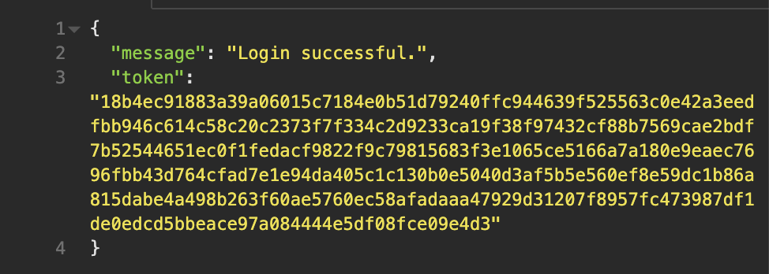

# Hope Helpers Back End

## Connie Jacques and Sarah Landis

### Deployments:

- Front End:
- Back End:

### Repositories: 

- Front End: https://github.com/Sarah-Connie/hope-hunters-front-end
- Back End: https://github.com/Sarah-Connie/hope-hunters-back-end

### Trello Board:

https://trello.com/b/7NMGHoN7/full-stack-app

### Scripts: 

- Development: npm run start-prod
- Testing: npm run start-test
- Jest Coverage: npm run jest-coverage
- Seed Development Database: npm run seed-dev
- Seed Test Database: npm run seed-test 

***Please note: the database must be re-seeded before tests can be run. Some fields on the schema are set to unique and will throw errors if attempting to add duplicate data in the generalusers and policeusers collections. Execute: npm run seed-test EVERY TIME before executing: npm run start-test***

### Directives: 

- If setting up a MongoDB local development database for the purpose of marking this assessment the database must be named: hope-hunters-dev
- If setting up MongoDB local testing database for the purpose of marking this assessment the database must be named: hope-hunters-testdb

- Node is configured to run on port 3000 (default). If you are unable to use this port, please change the POST variable on line 8 of the server.js file at the root of this directory. 

### Endpoints:

*Development Route ONLY* \
**URL Path:** /users/ \
**Description:** Get all documents in the generalusers and policeusers collection \
**HTTP Method:** GET \
**Authentication Type:** N/A \
**Authorisation Required:** N/A \
**Request Body:** NIL \
**Request Headers:** NIL \
**Successful Response Example:**

**URL Path:** /users/signup \
**Description:** User sign up. Adds a new user to the generalusers or policeusers collection \
**HTTP Method:** POST \
**Authentication Type:** NIL \
**Authorisation Required:** NIL \
**Request Body:** 

**Request Headers:** NIL \
**Successful Response Example:**

**URL Path:** /users/signup/general/confirmation/:email \
**Description:** Verify user's email address. When route is hit, add a JSON Web Token to the user document \
**HTTP Method:** PUT \
**Authentication Type:** NIL \
**Authorisation Required:** Email address must match an unverified generaluser document \
**Request Body:** NIL \
**Request Headers:** NIL \
**Successful Response Example:**

**URL Path:** /users/signup/police/confirmation/:email \
**Description:** Verify user's email address. When route is hit, add a JSON Web Token to the user document \
**HTTP Method:** PUT \
**Authentication Type:** NIL \
**Authorisation Required:** Email address must match an unverified policeuser document \
**Request Body:** NIL \
**Request Headers:** NIL \
**Successful Response Example:**

**URL Path:** /users/login \
**Description:** User log in \
**HTTP Method:** POST \
**Authentication Type:** NIL \
**Authorisation Required:** Email and password must match verified or unverified gereraluser or policeuser document \
**Request Body:**

**Request Headers:** NIL \
**Successful Response Example:**

**URL Path:** /users/login/refresh-token \
**Description:** Called immediately after user login in front end before redirecting to homepage. Updates jwt on user document and sends new jwt in response.body \
**HTTP Method:** PUT \
**Authentication Type:** JSON Web Token \
**Authorisation Required:** Verifiable JSON Web Token must match verified gereraluser or policeuser document \
**Request Body:** NIL \
**Request Headers:** authorization: Bearer ${JSON Web Token} \
**Successful Response Example:**

**URL Path:** /users/update \
**Description:** Allow a user to change the details in the database for their document only \
**HTTP Method:** PUT \
**Authentication Type:** JSON Web Token \
**Authorisation Required:** Verifiable JSON Web Token must match the verified gereraluser or policeuser document that is to be altered \
**Request Body:** Fields to change

**Request Headers:** authorization: Bearer ${JSON Web Token} \
**Successful Response Example:** \
Before:

After:

**URL Path:** /users/delete \
**Description:** Allow a user to delete their document from the database \
**HTTP Method:** DELETE \
**Authentication Type:** JSON Web Token \
**Authorisation Required:** Verifiable JSON Web Token must match the verified gereraluser or policeuser document that is to be altered \
**Request Body:** NIL \
**Request Headers:** authorization: Bearer ${JSON Web Token} \
**Successful Response Example:**

**URL Path:** /missing/ \
**Description:** Allow anyone to get all documents in the missingpersons collection, sorted in descending order by dateAdded (newest to oldest) \
**HTTP Method:** GET \
**Authentication Type:** NIL \
**Authorisation Required:** NIL \
**Request Body:** NIL \
**Request Headers:** NIL \
**Successful Response Example:**

**URL Path:** /missing/new \
**Description:** Allow a user to add a new missing person listing to the database \
**HTTP Method:** POST \
**Authentication Type:** JSON Web Token \
**Authorisation Required:** Verifiable JSON Web Token must match a verified gereraluser or policeuser document \
**Request Body:**

**Request Headers:** authorization: Bearer ${JSON Web Token} \
**Successful Response Example:**

**URL Path:** /missing/update/:id where :id is the _id of the document to be altered \
**Description:** Allow a user to update a document in the missingpersons collection \
**HTTP Method:** PUT \
**Authentication Type:** JSON Web Token \
**Authorisation Required:** Verifiable JSON Web Token must match the verified gereraluser document that owns the document to be altered OR belong to any admin user OR belong to any policeuser \
**Request Body:**

**Request Headers:** authorization: Bearer ${JSON Web Token} \
**Successful Response Example:**

**URL Path:** /missing/delete/:id where :id is the _id of the document to be altered \
**Description:** Allow a user to permanently a document in the missingpersons collection \
**HTTP Method:** DELETE \
**Authentication Type:** JSON Web Token \
**Authorisation Required:** Verifiable JSON Web Token must match the verified gereraluser document that owns the document to be altered OR belong to any admin user OR belong to any policeuser \
**Request Body:** NIL \
**Request Headers:** authorization: Bearer ${JSON Web Token} \
**Successful Response Example:**

