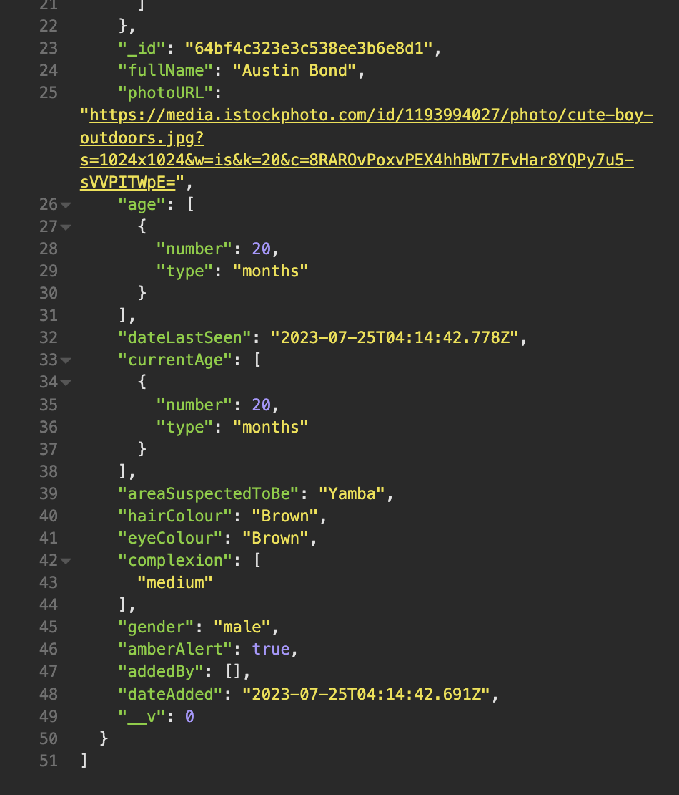
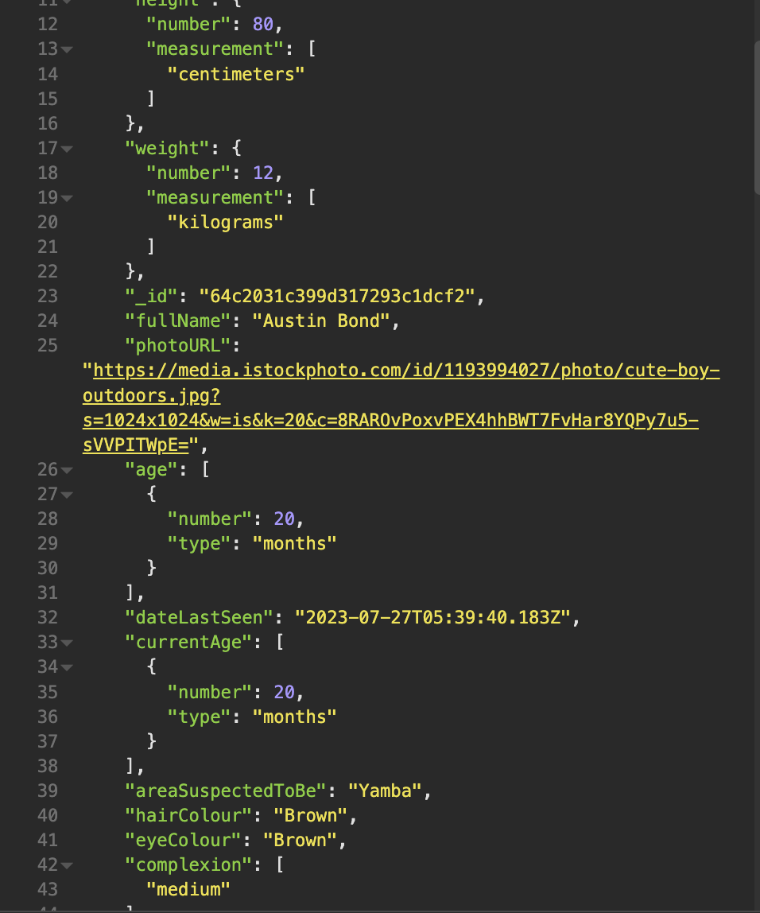
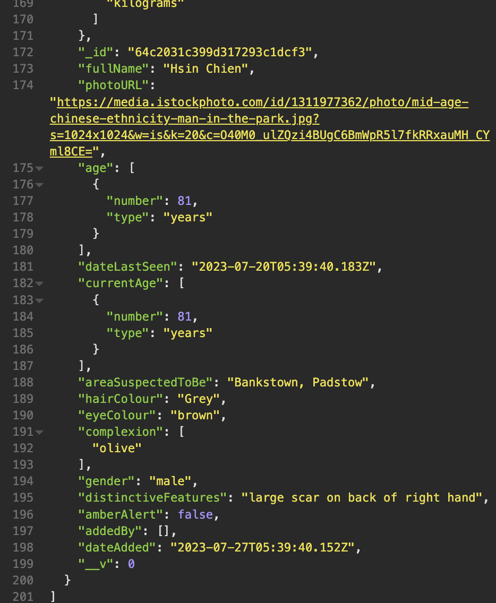
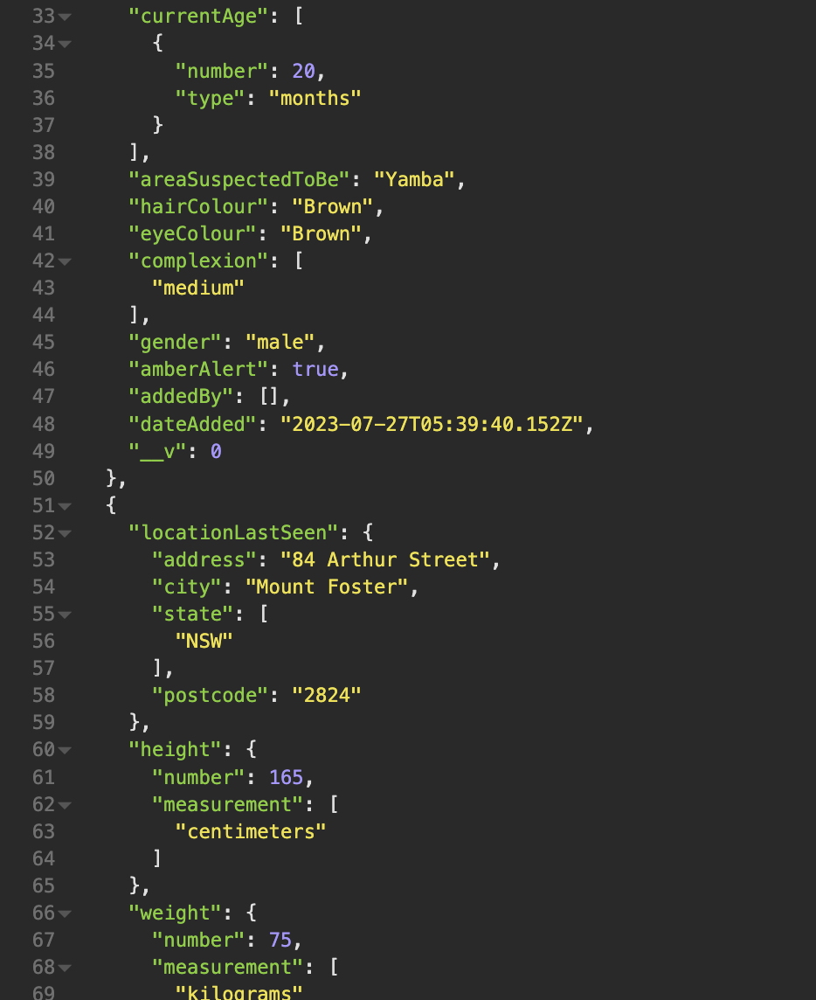
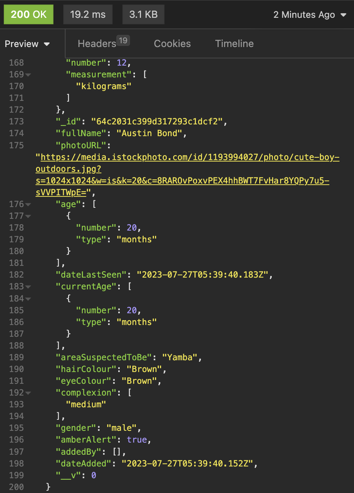

# Hope Helpers Back End

## Connie Jacques and Sarah Landis

### Deployments:

- Front End:
- Back End: http://ec2-3-26-148-33.ap-southeast-2.compute.amazonaws.com:5001/

### Repositories: 

- Part A: https://github.com/Sarah-Connie/T3A2-A
- Front End: https://github.com/Sarah-Connie/hope-hunters-front-end
- Back End: https://github.com/Sarah-Connie/hope-hunters-back-end

### Trello Board:

https://trello.com/b/7NMGHoN7/full-stack-app

### Installing Dependencies:

Use ```npm install``` to install all dependencies. Please note that due to an issue with a depreciated dependency required by the package ```mongoose_fuzzy_searching``` this project installs two versions of mongoose (v7.4.1 is required for the project to run; however, v5.10.19 required to enable ```mongoose-fuzzy-search``` to install). If you have issues installing the dependencies, delete the node_modules and package-lock.json files (if created), remove ```"mongoose": "^7.4.1",``` from the package.json file so that it will install mongoose5.10.19 only and execute ```npm install``` again before executing ```npm install mongoose7.4.1``` to upgrade the mongoose to the version required for correct functionality of the api.

If this does not work, please delete the node_modules and package-lock.json files (if created), remove ```"mongoose-fuzzy-searching": "^2.0.2",``` and ```"mongoose": "^5.10.19",``` from the package.json file, execute ```npm install``` again before executing ```npm install mongoose-fuzzy-searching --legacy-peer-deps```.

### Secrets

This project uses secrets stored in environmental variables. When cloning this project from GitHub, you will not have access to the required secrets and the project will not run. Please add a .env file at the root of the project and copy and paste the contents of the matching file from the back-end sub-directory in the the submitted document.
### Scripts: 

**Development:**
- Seed Development Database: npm run seed-dev
- Development: npm run start-dev

**Testing:**
- Seed Test Database: npm run seed-test 
- Testing: npm run start-test
- Jest Coverage: npm run jest-coverage

***Please note: the test database must be re-seeded before tests can be repeated. Some fields on the schema are set to unique and will throw errors if attempting to add duplicate data in the generalusers and policeusers collections. Execute: npm run seed-test EVERY TIME before executing: npm run start-test or npm run jest-coverage***

### Directives: 

- If setting up a MongoDB local development database for the purpose of marking this assessment the database must be named: hope-hunters-dev
- If setting up MongoDB local testing database for the purpose of marking this assessment the database must be named: hope-hunters-testdb

- Node is configured to run on port 5001. If you are unable to use this port, please change the POST variable on line 10 of the server.js file in the src sub-folder in this directory. 

### Endpoints:

*Development Route ONLY* \
**URL Path:** /users/ \
**Description:** Get all documents in the generalusers and policeusers collection \
**HTTP Method:** GET \
**Authentication Type:** N/A \
**Authorisation Required:** N/A \
**Request Body:** NIL \
**Request Headers:** NIL \
**Successful Response Example:**


**URL Path:** /users/signup \
**Description:** User sign up. Adds a new user to the generalusers or policeusers collection \
**HTTP Method:** POST \
**Authentication Type:** NIL \
**Authorisation Required:** NIL \
**Request Body:** 


**Request Headers:** NIL \
**Successful Response Example:**


**URL Path:** /users/signup/general/confirmation/:email \
**Description:** Verify user's email address. When route is hit, add a JSON Web Token to the user document \
**HTTP Method:** PUT \
**Authentication Type:** NIL \
**Authorisation Required:** Email address must match an unverified generaluser document \
**Request Body:** NIL \
**Request Headers:** NIL \
**Successful Response Example:**


**URL Path:** /users/signup/police/confirmation/:email \
**Description:** Verify user's email address. When route is hit, add a JSON Web Token to the user document \
**HTTP Method:** PUT \
**Authentication Type:** NIL \
**Authorisation Required:** Email address must match an unverified policeuser document \
**Request Body:** NIL \
**Request Headers:** NIL \
**Successful Response Example:**


**URL Path:** /users/login \
**Description:** User log in \
**HTTP Method:** POST \
**Authentication Type:** NIL \
**Authorisation Required:** Email and password must match verified or unverified gereraluser or policeuser document \
**Request Body:**


**Request Headers:** NIL \
**Successful Response Example:**


**URL Path:** /users/login/refresh-token \
**Description:** Called immediately after user login in front end before redirecting to homepage. Updates jwt on user document and sends new jwt in response.body \
**HTTP Method:** PUT \
**Authentication Type:** JSON Web Token \
**Authorisation Required:** Verifiable JSON Web Token must match verified gereraluser or policeuser document \
**Request Body:** NIL \
**Request Headers:** authorization: Bearer ${JSON Web Token} \
**Successful Response Example:**


**URL Path:** /users/update \
**Description:** Allow a user to change the details in the database for their document only \
**HTTP Method:** PUT \
**Authentication Type:** JSON Web Token \
**Authorisation Required:** Verifiable JSON Web Token must match the verified gereraluser or policeuser document that is to be altered \
**Request Body:** Fields to change


**Request Headers:** authorization: Bearer ${JSON Web Token} \
**Successful Response Example:** \
Before:


After:


**URL Path:** /users/delete \
**Description:** Allow a user to delete their document from the database \
**HTTP Method:** DELETE \
**Authentication Type:** JSON Web Token \
**Authorisation Required:** Verifiable JSON Web Token must match the verified gereraluser or policeuser document that is to be altered \
**Request Body:** NIL \
**Request Headers:** authorization: Bearer ${JSON Web Token} \
**Successful Response Example:**


**URL Path:** /users/missing/all \
**Description:** All a logged in, verified user to get all missingpersons documents that they own \
**HTTP Method:** GET \
**Authentication Type:** JSON Web Token \
**Authorisation Required:** Verifiable JSON Web Token must match verified gereraluser or policeuser document \
**Request Body:** NIL \
**Request Headers:** authorization: Bearer ${JSON Web Token} \
**Successful Response Example:**


**URL Path:** /missing/ \
**Description:** Allow anyone to get all documents in the missingpersons collection, sorted in descending order by dateAdded (newest to oldest) \
**HTTP Method:** GET \
**Authentication Type:** NIL \
**Authorisation Required:** NIL \
**Request Body:** NIL \
**Request Headers:** NIL \
**Successful Response Example:**


**URL Path:** /missing/new \
**Description:** Allow a user to add a new missing person listing to the database \
**HTTP Method:** POST \
**Authentication Type:** JSON Web Token \
**Authorisation Required:** Verifiable JSON Web Token must match a verified gereraluser or policeuser document \
**Request Body:**


**Request Headers:** authorization: Bearer ${JSON Web Token} \
**Successful Response Example:**

*User Type: General*


*User Type: Police*


**URL Path:** /missing/update/:id where :id is the _id of the document to be altered \
**Description:** Allow a user to update a document in the missingpersons collection \
**HTTP Method:** PUT \
**Authentication Type:** JSON Web Token \
**Authorisation Required:** Verifiable JSON Web Token must match the verified gereraluser document that owns the document to be altered OR belong to any admin user OR belong to any policeuser \
**Request Body:**


**Request Headers:** authorization: Bearer ${JSON Web Token} \
**Successful Response Example:**


**URL Path:** /missing/delete/:id where :id is the _id of the document to be altered \
**Description:** Allow a user to permanently a document in the missingpersons collection \
**HTTP Method:** DELETE \
**Authentication Type:** JSON Web Token \
**Authorisation Required:** Verifiable JSON Web Token must match the verified gereraluser document that owns the document to be altered OR belong to any admin user OR belong to any policeuser \
**Request Body:** NIL \
**Request Headers:** authorization: Bearer ${JSON Web Token} \
**Successful Response Example:**


**URL Path:** /missing/search/:search where :search is a parameter to match a fuzzy search query string on the fields: fullName, areaSuspectedToBe, hairColour, eyeColour, complexion, distinctiveFeatures, age and currentAge (one number only of length less than four digits) and year on the dateLastSeen field (one number only of4 digit length) \
**Description:** Allow any user to perform a fuzzy search for any missingpersons document/s \
**HTTP Method:** GET \
**Authentication Type:** NIL \
**Authorisation Required:** NIL \
**Request Body:** NIL \
**Request Headers:** NIL \
**Successful Response Example:**


**URL Path:** /missing/users/search/:search where :search is a parameter to match a fuzzy search query string on the fields: fullName, areaSuspectedToBe, hairColour, eyeColour, complexion, distinctiveFeatures, age and currentAge \
**Description:** Allow an logged in, verified user to perform a fuzzy search for missingpersons document/s that they own \
**HTTP Method:** GET \
**Authentication Type:** JSON Web Token \
**Authorisation Required:** Verifiable JSON Web Token must match the verified gereraluser or policeuser document that owns the missingpersons document/s being searched for \
**Request Body:** NIL \
**Request Headers:** authorization: Bearer ${JSON Web Token} \
**Successful Response Example:**


**URL Path:** /missing/amber-alerts \
**Description:** Get all missingpersons documents where the field amberAlert equals true \
**HTTP Method:** GET \
**Authentication Type:** NIL \
**Authorisation Required:** NIL \
**Request Body:** NIL \
**Request Headers:** NIL \
**Successful Response Example:**





**URL Path:** /missing/sorted/:option where :option must be fullName, lastSeen, ageYoungest, ageOldest, currentAge, dateLastSeenNewest or dateLastSeenOldest \
**Description:** Get all missingpersons documents and sort them per user request. Uses a switch case to match the request parameter to a case in the controller that will return the documents sorted by the corresponding field: fullName (A - Z), locationLastSeen (A - Z), age (ascending), age (descending), dateLastSeen (descending) or dateLastSeen (ascending) \
**HTTP Method:** GET \
**Authentication Type:** NIL \
**Authorisation Required:** NIL \
**Request Body:** NIL \
**Request Headers:** NIL \
**Successful Response Example:**

*option: fullName*





*option: lastSeen*


*option: ageYoungest*





*option: ageOldest*


*option: currentAge*


*option: dateLastSeenNewest*





*option: dateLastSeenOldest*





### Comparison to Plan in Part A

The content of Part A can be found in this repository: https://github.com/Sarah-Connie/T3A2-A

